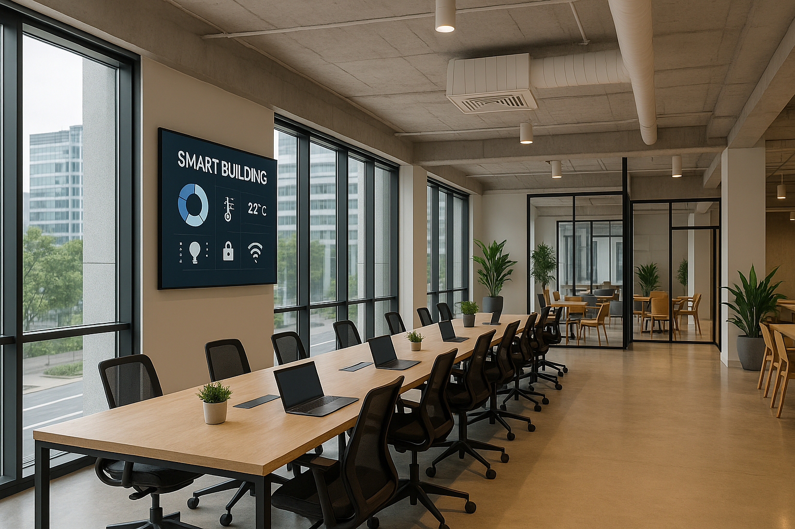
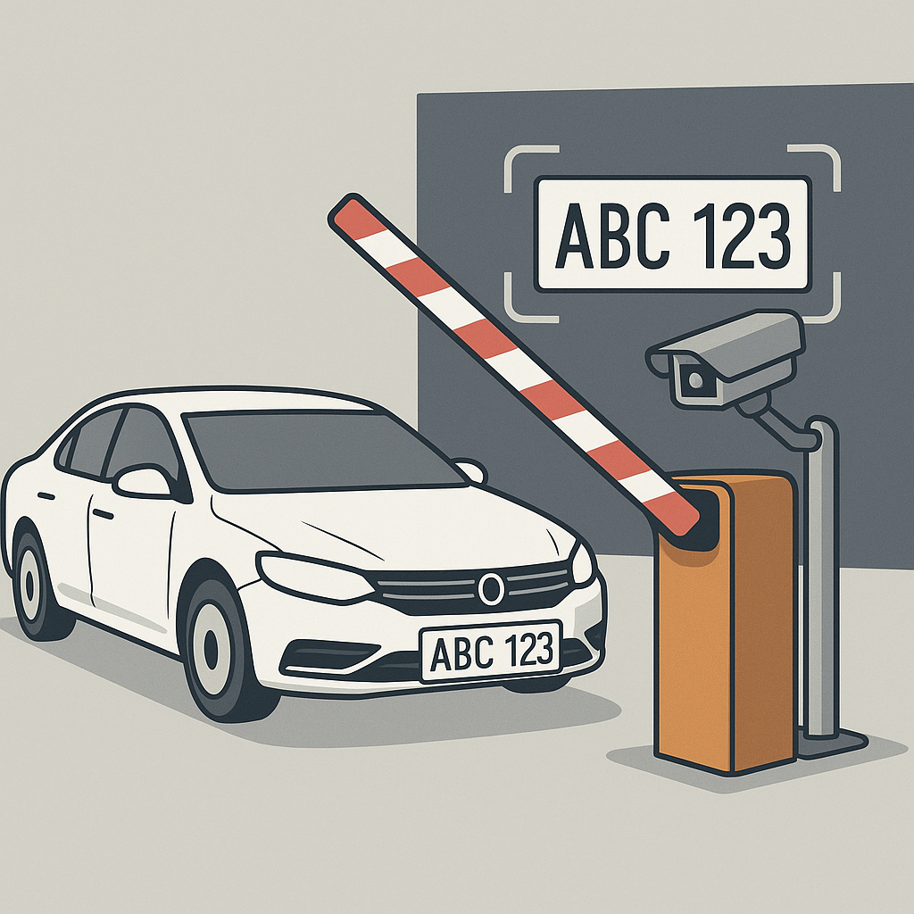
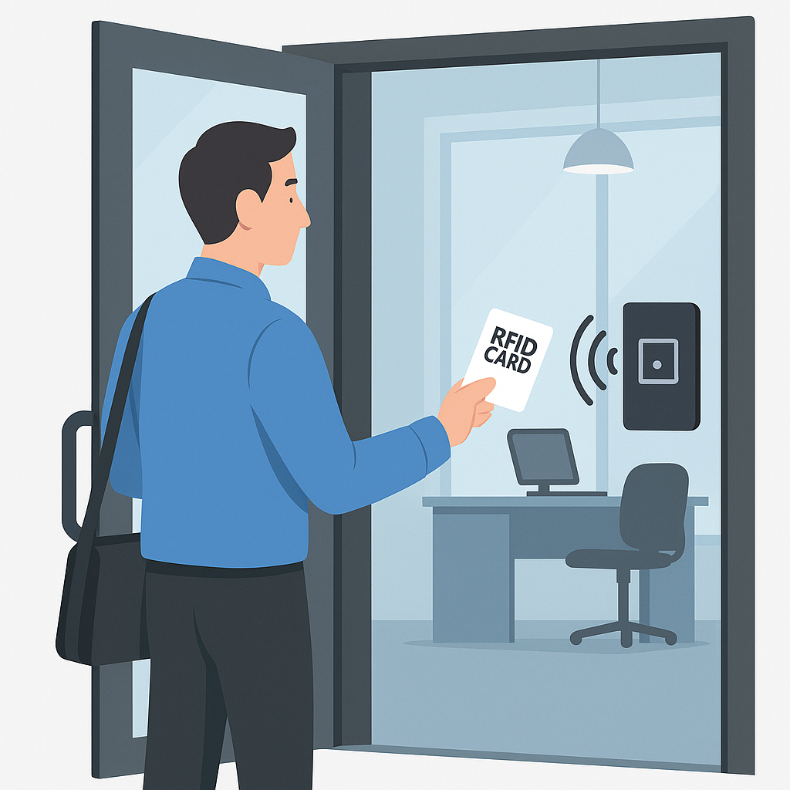
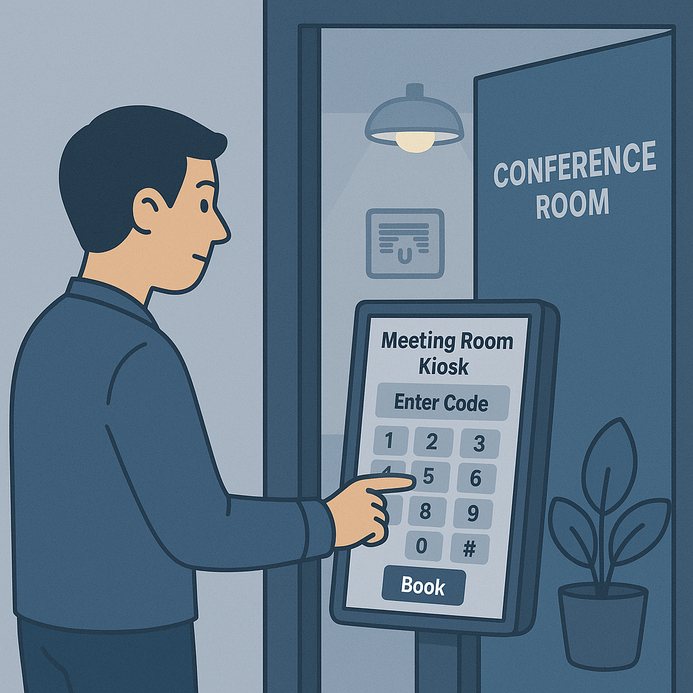

# 스마트 건물 관리 시스템: 공유오피스 (Team1‑IoT / Joeffice)

  

> **RFID 출입 · 주차 번호판 인식 · 냉난방/조명 제어 · 회의실 예약/출입**을 하나로 묶은 IoT 프로젝트. Python(PyQt6) GUI와 Arduino 센서/액추에이터, MySQL DB로 동작합니다.

---

  

## 목차

* [프로젝트 개요](#프로젝트-개요)
* [핵심 기능](#핵심-기능)
* [시스템 아키텍처](#시스템-아키텍처)
* [하드웨어 구성](#하드웨어-구성)
* [소프트웨어 스택](#소프트웨어-스택)

---

## 프로젝트 개요

공유오피스 시나리오를 기반으로, **주차 → 출근 → 회의실 예약/입실 → 퇴근**의 하루 흐름에 맞춰 빌딩 설비를 자동 제어합니다.

* **RFID 인증 + DB**로 출입/근태 관리
* **FIRST_IN / LAST_OUT** 이벤트로 **건물 전체 냉난방·조명** 자동 제어
* **번호판 인식(YOLOv8) + OCR**로 주차 등록/출입 제어
* **회의실 예약/인증** → 입실 시 **회의실 냉난방·조명·잠금(서보)** 제어

---

## 핵심 기능

### 1) 주차 시스템

  

* **YOLOv8 가중치**로 번호판 감지 → **OCR(PaddleOCR)** 로 문자 추출
* 차량번호 등록/조회, **게이트(서보) 제어**, 실시간 주차 현황/로그
* 비상 시 **수동 차단봉 제어** 제공

### 2) 건물 출입 관리 (RFID)

  

* 직원/방문객 등록 및 출입 이력 기록
* 첫 출근(FIRST_IN) / 마지막 퇴근(LAST_OUT) 이벤트 연동

### 3) 건물 냉난방·조명

  

* FIRST_IN 시 **ON**, LAST_OUT 시 **OFF**
* 온습도 센서(DHT11), RGB LED(상태 표시), 실조명 LED 제어
* 관리자 GUI에서 상태 모니터링

### 4) 회의실 예약/출입/설비

  

* `rooms / users / reservations` 테이블 기반 예약 관리
* **인증번호 4자리** 발급, 상태: `BOOKED / CHECKED_IN / CHECKED_OUT / CANCELED`

  

* 입실 인증 후 회의실 **냉난방·조명·잠금(서보)** 제어

---

## 시스템 아키텍처

* **엣지 디바이스(Arduino)**: RFID(MFRC522), DHT11, RGB LED, 조명 LED, 서보 모터
* **모델/비전**: YOLOv8 번호판 검출, PaddleOCR(한/영)
* **데이터베이스**: MySQL — 출입/주차/예약/회의실 상태 관리
* **이벤트 기반 제어**: FIRST_IN / LAST_OUT / 예약 체크인/아웃 → 설비 ON/OFF/Lock

---

## 하드웨어 구성

* **Arduino (예: UNO/MEGA)**
* **RFID 리더**: MFRC522
* **서보 모터**: 차단봉/문 잠금 제어
* **온습도 센서**: DHT11 (냉난방 상태 판단/표시)
* **RGB LED / LED**: 냉난방·조명 상태 표시
* **카메라(웹캠)**: 번호판 촬영용

---

## 소프트웨어 스택

* **Python 3.10+ / PyQt6** — 관리/운영 GUI
* **OpenCV / ultralytics YOLOv8 / PaddleOCR** — 번호판 인식 파이프라인
* **mysql-connector-python** — DB 연동
* **Arduino (C/C++)** — 센서/액추에이터 제어 펌웨어

---

> ⚠️ 경로 대소문자 주의: 위 README는 폴더명이 **Asset/**(대문자 A)인 경우 기준입니다. 폴더 이름이 `asset/`(소문자)라면 이미지 경로도 소문자로 바꾸거나 폴더명을 맞춰주세요.
